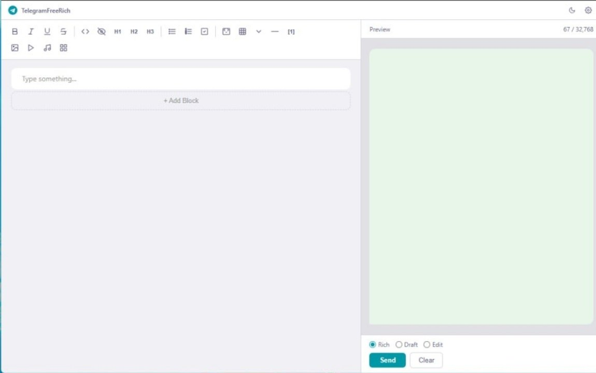

<p align="center">
  
</p>

<p align="center">
  
  
  
  
</p>

<h1 align="center">تله‌گرام‌فری‌ریچ</h1>

<p align="center"><strong>ویرایشگر متن غنی رایگان برای تلگرام — نسخه دسکتاپ</strong></p>
<p align="center">چون بات‌ها نباید از انسان‌ها حقوق بیشتری داشته باشند.</p>

<p align="center"><a href="README.md">[ English ]</a></p>

<p align="center">
  <a href="#دانلود">دانلود</a> •
  <a href="#قابلیت‌ها">قابلیت‌ها</a> •
  <a href="#معماری">معماری</a> •
  <a href="#نصب">نصب</a> •
  <a href="#نحوه-استفاده">نحوه استفاده</a> •
  <a href="#بیلد">بیلد</a>
</p>

<p align="center">
  
</p>

---

## دانلود

| پلتفرم | دانلود |
|---------|--------|
| **ویندوز** | [TelegramFreeRich-Setup.exe](https://github.com/Aporis3674/TelegramFreeRich/releases/latest) |

ویندوز ۱۰ یا بالاتر. نیازی به نصب Node.js یا سایر وابستگی‌ها نیست.

## این پروژه چیه؟

تلگرام در ژوئن ۲۰۲۶ ویرایشگر متن غنی معرفی کرد (Bot API 10.1)، اما فقط برای کاربران Premium. در حالی که دقیقاً همان API به بات‌ها همان قابلیت‌ها را به صورت رایگان می‌دهد.

این اپ دسکتاپ به هر کسی اجازه می‌دهد -- نه فقط مشترکین Premium -- پیام‌های حرفه‌ای و قالب‌بندی شده از طریق Bot API تلگرام ارسال کند.

بدون نیاز به کدنویسی. بدون نیاز به Premium. بدون نیاز به سرور.

## قابلیت‌ها

### قالب‌بندی درون‌خطی
- پررنگ، کج، زیرخط، خط‌خورده
- اسپویلر، کد درون خطی

### المان‌های بلوکی
- سرتیتر H1 تا H6
- نقل‌قول با ذکر منبع، نقل‌قول برجسته (Pull Quote)
- بلوک کد با انتخاب زبان
- خط جداکننده
- بلوک تاشو (جزئیات)

### لیست‌ها
- لیست گلوله‌ای
- لیست شماره‌دار
- چک‌لیست (فرمت markdown: `- [x]` / `- [ ]`)

### جدول
- سلول‌های قابل ویرایش
- دکمه‌های افزودن ردیف/ستون

### رسانه
- تصویر (URL)
- ویدیو، صدا
- اسلایدشو (چند تصویر)

### اتصال به API
- ارسال با `sendRichMessage` و فرمت markdown
- ویرایش پیام با `editMessageText` + `rich_message`
- ارسال پیش‌نویس با `sendRichMessageDraft` (۳۰ ثانیه)
- دکمه تست اتصال (`getMe`)

### امکانات ویرایشگر
- **ویرایشگر بلوک‌محور** -- هر المان یه کارت قابل جابه‌جایی (شبیه Notion)
- پیش‌نمایش زنده با حباب پیام تلگرام
- تم تاریک (پیش‌فرض) + تم روشن
- نوار ابزار ۳ گروهی: درون‌خطی، بلوک، رسانه
- منوی درج بلوک
- کلیدهای میانبر (Ctrl+B, Ctrl+I, Ctrl+U, Ctrl+E)
- کشیدن و رها کردن فایل‌های رسانه
- شمارشگر کاراکتر (حداکثر ۳۲۷۶۸)
- پنل تنظیمات (توکن ربات، شناسه چت، زبان)
- دکمه پاک کردن همه
- اعلان‌های توست
- جابه‌جایی بلوک‌ها با drag-and-drop

## معماری

ویرایشگر از یک **state بلوک‌محور JSON** استفاده می‌کند. هنگام ارسال، بلوک‌ها از طریق `htmlToMarkdown()` به **Markdown تلگرام** تبدیل شده و از طریق فیلد `markdown` در `InputRichMessage` ارسال می‌شوند.

```
State ویرایشگر (JSON[])          htmlToMarkdown()         Telegram Bot API
  +-----------+                    |                   +------------------+
  | paragraph |--- متن HTML        v                   | InputRichMessage |
  | heading   |--- متن HTML    رشته markdown --------->|   markdown: "..."|
  | code-block|--- کد                                  +------------------+
  | table     |--- سلول‌ها[][]
  | list      |--- آیتم‌ها[]
  | details   |--- خلاصه، متن HTML
  | image     |--- URL، کپشن         خروجی markdown:
  | video     |--- URL، کپشن         **bold** *italic*
  | slideshow |--- تصاویر[]          # سرتیتر
  | divider   |                      - لیست گلوله‌ای
  | pull-quote|--- متن، منبع         1. لیست شماره‌دار
  | footer    |--- متن               - [x] چک‌لیست
  | checklist |--- آیتم‌ها[]          --- جداکننده
  +-----------+                      | جدول |
                                      ````کد````
                                      > نقل‌قول
                                      <details>...</details>
```

### تبدیل قالب‌بندی درون‌خطی

تابع `htmlToMarkdown()` HTML ادیتور را به markdown تلگرام تبدیل می‌کند:

| HTML ادیتور | Markdown تلگرام |
|-------------|-----------------|
| `<strong>متن</strong>` | `**متن**` |
| `<em>متن</em>` | `*متن*` |
| `<u>متن</u>` | `<u>متن</u>` |
| `<s>متن</s>` | `~~متن~~` |
| `<code>متن</code>` | `` `متن` `` |
| `<span class="tg-spoiler">متن</span>` | `\|\|متن\|\|` |

## نصب

### پیش‌نیازها
- Node.js نسخه ۱۸ یا بالاتر (فقط برای ساخت از سورس)
- یک ربات تلگرام (از @BotFather بگیرید)
- شناسه چت (کانال یا گروه)

### شروع سریع (دانلود)

1. آخرین نسخه را از [صفحه دانلود](https://github.com/Aporis3674/TelegramFreeRich/releases/latest) دانلود کنید
2. `TelegramFreeRich-Setup.exe` را اجرا کنید
3. اپ را باز کنید
4. روی تنظیمات (آیکون چرخ دنده) کلیک کنید
5. توکن ربات را وارد کنید (از @BotFather)
6. شناسه چت را وارد کنید
7. «تست اتصال» را بزنید
8. شروع به نوشتن کنید و «ارسال» را بزنید

### از سورس

```bash
git clone https://github.com/Aporis3674/TelegramFreeRich.git
cd TelegramFreeRich
npm install
npm start
```

## نحوه استفاده

۱. پیام خود را در ویرایشگر بنویسید (پنل سمت چپ)
۲. از نوار ابزار برای فرمت‌بندی استفاده کنید
۳. پیش‌نمایش زنده در سمت راست ببینید
۴. «ارسال» را بزنید

### حالت‌های ارسال

| حالت | دکمه | زمان استفاده |
|------|-------|--------------|
| Rich | ارسال | پیام فرمت‌شده (توصیه می‌شود) |
| Draft | Draft | پیش‌نمایش ۳۰ ثانیه‌ای (فقط چت خصوصی) |
| Edit | Edit | ویرایش پیام موجود (شناسه پیام را وارد کنید) |

### گروه‌های نوار ابزار

| گروه | دکمه‌ها |
|-------|---------|
| **درون‌خطی** | پررنگ، کج، زیرخط، خط‌خورده، کد، اسپویلر |
| **بلوک** | سرتیتر H1-H3، لیست گلوله‌ای، لیست شماره‌دار، چک‌لیست، کد بلند، جدول، تاشو، جداکننده، پانویس |
| **رسانه** | تصویر، ویدیو، اسلایدشو |

## بیلد

### ویندوز

```bash
npm run build
# خروجی: dist/TelegramFreeRich-Setup-2.0.0.exe
```

### لینوکس

```bash
npm run build:linux
```

## ویژگی‌های Markdown (تست شده)

بولد، ایتالیک، اندرلاین، استرایک‌ترو، اسپویلر، کد درون خطی، سرتیتر، لیست‌ها، چک‌لیست‌ها، جدول، نقل‌قول، بلوک کد، جداکننده، جزئیات/خلاصه، پانویس

### رسانه
تصویر (``)، ویدیو، صدا، اسلایدشو

### چک‌لیست
فرمت markdown: `- [x] انجام شده` / `- [ ] انجام نشده` (از طریق `sendRichMessage` markdown ارسال می‌شود)

## کلیدهای میانبر

| کلید | عملکرد |
|------|--------|
| Ctrl+B | پررنگ |
| Ctrl+I | کج |
| Ctrl+U | زیرخط |
| Ctrl+E | کد درون خطی |

## تکنولوژی

| لایه | تکنولوژی |
|------|-----------|
| پوسته دسکتاپ | Electron 35 |
| فانت‌اند | HTML + CSS + JavaScript خالص |
| مدل داده | Block State (JSON array) |
| خروجی | InputRichMessage.markdown |
| تبدیل | htmlToMarkdown (HTML به MD تلگرام) |
| تم | متغیرهای CSS (تاریک + روشن) |
| پکیج‌بندی | electron-builder (NSIS) |

## ساختار پروژه

```
TelegramFreeRich/
  src/
    main/
      main.js           # پردازشگر اصلی Electron
      preload.js        # پل ارتباطی امن IPC
    renderer/
      index.html        # رابط کاربری
      app.js            # هسته: state بلوک‌ها، ویرایشگر، API
      styles/
        app.css         # تم تاریک/روشن، لایوت
  Documentation.html    # مرجع API و انواع تست شده
  Specification.md      # مشخصات طراحی فارسی
  package.json          # وابستگی‌ها و تنظیمات ساخت
```

## مجوز

MIT

---

> بهترین چیزهای زندگی رایگان هستند. دومین چیزهای خوب هم رایگان هستند -- اگر از یه بات استفاده کنید.
