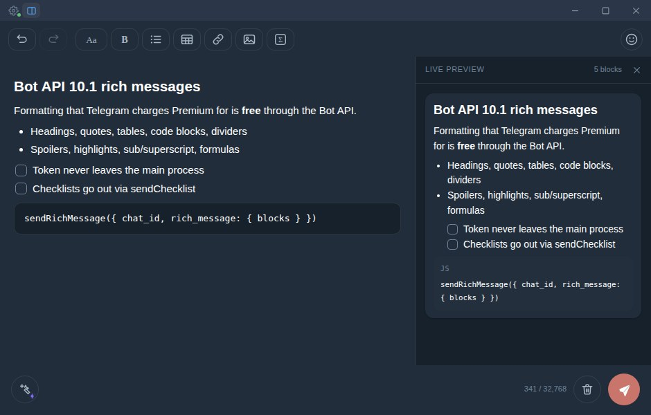

<p align="center">
  
</p>

<p align="center">
  
  
  
  
  
  
</p>

<h1 align="center">تله‌گرام‌فری‌ریچ</h1>

<p align="center"><strong>ویرایشگر متن غنی رایگان برای تلگرام — نسخه دسکتاپ</strong></p>
<p align="center">چون بات‌ها نباید از انسان‌ها حقوق بیشتری داشته باشند.</p>

<p align="center"><a href="README.md">[ English ]</a></p>

<p align="center">
  <a href="#دانلود">دانلود</a> •
  <a href="#رابط-کاربری">رابط کاربری</a> •
  <a href="#قابلیت‌ها">قابلیت‌ها</a> •
  <a href="#معماری">معماری</a> •
  <a href="#نصب">نصب</a> •
  <a href="#نحوه-استفاده">نحوه استفاده</a> •
  <a href="#بیلد">بیلد</a> •
  <a href="#توسعه">توسعه</a>
</p>

---

## دانلود

| پلتفرم | دانلود |
|---------|--------|
| **ویندوز** | [TelegramFreeRich-Setup.exe](https://github.com/Aporis3674/TelegramFreeRich/releases/latest) |

ویندوز ۱۰ یا بالاتر. نیازی به نصب Node.js یا سایر وابستگی‌ها نیست.

---

## این پروژه چیه؟

تلگرام در ژوئن ۲۰۲۶ ویرایشگر متن غنی معرفی کرد (Bot API 10.1)، اما فقط برای کاربران Premium. در حالی که دقیقاً همان API به بات‌ها همان قابلیت‌ها را به صورت رایگان می‌دهد.

این اپ دسکتاپ به هر کسی اجازه می‌دهد -- نه فقط مشترکین Premium -- پیام‌های حرفه‌ای و قالب‌بندی شده از طریق Bot API تلگرام ارسال کند.

بدون نیاز به کدنویسی. بدون نیاز به Premium. بدون نیاز به سرور.

---

## رابط کاربری



پنجره، بازسازی دقیق ویرایشگر متن غنی تلگرام دسکتاپ است: پنجرهٔ بدون قاب و تیره، دکمه‌های
قرص‌مانند با حاشیهٔ مویی، ستاره‌های بنفش پرمیوم و یک دکمهٔ ارسال به رنگ صورتی‌آجری.

```
┌ ─────────────────────────────────────────────────────────  ─  □  ✕ ┐
│  ( ↶ )( ↷ )   ( Aa )( B )( ☰ )( ▦ )( 🔗 )( 🖼 )( Σ )         ( ☺ ) │
│                                                                    │
│  پیام                                            │  پیش‌نمایش زنده  │
│                                                 │                  │
│  ( ✦A )                        341 / 32,768   ( 🗑 )        ( ➤ )  │
└────────────────────────────────────────────────────────────────────┘
```

| کنترل | کارکرد |
|-------|--------|
| ↶ ↷ | بازگردانی / انجام دوباره (تاریخچهٔ کامل ProseMirror) |
| **Aa** | منوی سبک متن — متن معمولی، H1 تا H6، نقل‌قول، نقل‌قول برجسته، بلوک کد، پاورقی، بخش تاشو، جداکننده، کلید راست‌به‌چپ |
| **B** | منوی قالب‌بندی — پررنگ، کج، زیرخط‌دار، خط‌خورده، اسپویلر، هایلایت، تک‌فاصله، زیرنویس/بالانویس، پاک‌کردن قالب |
| ☰ | فهرست‌ها — نقطه‌ای، شماره‌دار، چک‌لیست (با `sendChecklist` ارسال می‌شود) |
| ▦ | جدول — درج ۳×۳، افزودن/حذف ردیف و ستون، حذف جدول |
| 🔗 | پیوند — افزودن یا حذف، همراه با پاک‌سازی نوع نشانی |
| 🖼 | رسانه — تصویر از نشانی یا فایل، ویدیو، صدا، اسلایدشو، کلاژ، موقعیت مکانی |
| Σ | فرمول — بلوکی یا درون‌خطی |
| ☺ | ایموجی با جست‌وجو و نوار دسته‌بندی |
| ✦A | پالت درج — فهرست جست‌وجوپذیر تمام بلوک‌ها و قالب‌ها در یک جا |
| 🗑 | پاک‌کردن پیام (با تأیید) |
| ➤ | ارسال. با کلیک راست، حالت ارسال را انتخاب کنید: پیام غنی، پیش‌نویس یا ویرایش |

نوار ابزار بدون نشان است؛ ستارهٔ بنفش داخل منوها کنار خود قابلیت‌هایی می‌آید که تلگرام برای
مشترکان پرمیوم نگه داشته — همهٔ آن‌ها اینجا رایگان‌اند، چون Bot API هرگز بابتشان پول نگرفته است.

---

## قابلیت‌ها

### قالب‌بندی درون‌خطی
- پررنگ، کج، زیرخط، خط‌خورده
- اسپویلر، هایلایت (marked)، کد درون خطی
- زیرنویس، بالانویس

### المان‌های بلوکی
- سرتیتر H1 تا H6
- نقل‌قول، نقل‌قول برجسته (Pull Quote)
- بلوک کد با انتخاب زبان
- خط جداکننده
- بلوک تاشو (جزئیات)
- پانویس (Footer)

### لیست‌ها و جدول
- لیست گلوله‌ای، لیست شماره‌دار
- چک‌لیست (از طریق API جداگانه `sendChecklist` ارسال می‌شود)
- سلول‌های قابل ویرایش

### رسانه
- تصویر از نشانی یا از انتخابگر فایل سیستم
- ویدیو، صدا
- اسلایدشو، کلاژ
- موقعیت مکانی (عرض/طول جغرافیایی)

### ریاضی
- بلوک فرمول و فرمول درون‌خطی (LaTeX)

### اتصال به API
- ارسال با `sendRichMessage` و **JSON ساختاریافته بلوک‌ها** (نه markdown)
- ویرایش پیام با `editMessageText` + `rich_message`
- ارسال پیش‌نویس با `sendRichMessageDraft` (۳۰ ثانیه)
- چک‌لیست از طریق API جداگانه `sendChecklist` ارسال می‌شود
- دکمه تست اتصال (`getMe`)

### امکانات ویرایشگر
- **رابط ویرایشگر تلگرام دسکتاپ** — پنجرهٔ بدون قاب با نوار عنوان اختصاصی، نوار ابزار قرصی،
  منوهای بازشو، انتخابگر ایموجی و دکمهٔ ارسال صورتی‌آجری
- **ویرایشگر مبتنی بر TipTap** — مدل سند ProseMirror با بازگردانی/انجام دوبارهٔ واقعی
- قواعد ورودی مارک‌داون — `## `، `> `، `- `، `1. `، ` ``` `، `**پررنگ**`، `` `کد` ``
- **پیش‌نمایش زنده** — پنل تاشو که همان Block State ارسالی را به شکل حبابِ تلگرام نشان می‌دهد
- پالت درج — جست‌وجوی هر بلوک و قالب با نام
- تم تاریک (پیش‌فرض) + تم روشن
- کلیدهای میانبر، از جمله Ctrl+Enter برای ارسال
- شمارشگر کاراکتر (حداکثر ۳۲٬۷۶۸)
- دیالوگ‌های اختصاصی به جای `prompt()` و `confirm()` مرورگر
- راست‌به‌چپ کامل: رابط فارسی کل پنجره را قرینه می‌کند، مستقل از پرچم RTL هر پیام

---

## معماری

### v4.0 — رابط بومی تلگرام + Block State با موجودیت‌های درون‌خطی (نسخه فعلی)

ویرایشگر از **TipTap** (مبتنی بر ProseMirror) برای ویرایش متن غنی استفاده می‌کند. محتوای کاربر از یک معماری **Block State** عبور می‌کند که مستقیماً با انواع JSON ساختاریافته Bot API تلگرام 10.1 مطابقت دارد:

```
ویرایشگر TipTap (DOM ProseMirror)
        │
        ▼
پارسر بلوک (DOM → Block State JSON[])
   ├─ سطح بلوک    → پاراگراف، عنوان، جدول، چک‌لیست، رسانه، …
   └─ سطح درون‌خطی → قطعه‌های سبک‌دار (پررنگ، اسپویلر، پیوند، ریاضی، …)
        │
        ▼
سریالایزر بلوک (Block State → JSON API تلگرام)
   ├─ blocks     → InputRichBlock*
   └─ rich_text  → اشیای تودرتوی RichText*
        │
        ├──→ sendRichMessage(blocks[])      [پیام‌های غنی]
        ├──→ sendRichMessageDraft(blocks[]) [پیش‌نویس ۳۰ ثانیه‌ای]
        └──→ sendChecklist(items[])         [فقط چک‌لیست]
```

قالب‌بندی درون‌خطی دیگر با `textContent` از دست نمی‌رود: `inline-parser.js` محتوای درون‌خطی هر
بلوک را به قطعه‌های `{ text, marks[], href? }` تبدیل می‌کند و سریالایزر آن‌ها را به اشیای
تودرتوی `RichText*` (پررنگ درون کج درون پیوند و …) در کنار فیلد سادهٔ `text` تبدیل می‌کند.

**چرا JSON بلوک‌ها به جای Markdown؟**
Bot API تلگرام 10.1 از انواع `InputRichBlock*` ساختاریافته پشتیبانی می‌کند که تمام قابلیت‌ها را پوشش می‌دهد (اسپویلر، جزئیات، جدول، ریاضی و ...). Markdown فقط زیرمجموعه‌ای را بیان می‌کند. JSON بلوک‌ها ۱۰۰٪ برابری قابلیت فراهم می‌کنند.

### انواع بلوک

| نوع بلوک | نوع Telegram API |
|-----------|-------------------|
| paragraph | `InputRichBlockParagraph` |
| heading | `InputRichBlockHeading` |
| blockquote | `InputRichBlockBlockquote` |
| pullquote | `InputRichBlockPullquote` |
| code_block | `InputRichBlockCodeBlock` |
| divider | `InputRichBlockDivider` |
| list | `InputRichBlockList` |
| table | `InputRichBlockTable` |
| details | `InputRichBlockDetails` |
| footer | `InputRichBlockFooter` |
| photo / video / audio | `InputRichBlockPhoto` و غیره |
| slideshow / collage | `InputRichBlockSlideshow` / `InputRichBlockCollage` |
| map | `InputRichBlockMap` |
| math_block | `InputRichBlockMath` |
| checklist | جداگانه با `sendChecklist` ارسال می‌شود |

### انواع درون‌خطی

| نشانهٔ قطعه | نوع Telegram API |
|-------------|-------------------|
| پررنگ / کج / زیرخط‌دار / خط‌خورده | `RichTextBold`، `RichTextItalic`، … |
| اسپویلر | `RichTextSpoiler` |
| هایلایت | `RichTextMarked` |
| کد | `RichTextCode` |
| زیرنویس / بالانویس | `RichTextSubscript` / `RichTextSuperscript` |
| پیوند | `RichTextLink` (شامل `url`) |
| ریاضی | `RichTextMath` |

### مدل امنیتی

```
┌─────────────────────────────────────────────────┐
│  پردازشگر Renderer (React)                      │
│                                                 │
│  ❌ توکن ربات اینجا ذخیره نمی‌شود              │
│  ❌ بدون fetch() مستقیم به API تلگرام           │
│  ✅ فراخوانی window.app.api(method, body)       │
└──────────────────────┬──────────────────────────┘
                       │ IPC (contextBridge)
┌──────────────────────▼──────────────────────────┐
│  پردازشگر Main (Electron)                       │
│                                                 │
│  ✅ توکن با safeStorage ذخیره می‌شود (رمزنگاری) │
│  ✅ تمام فراخوانی‌های API از اینجا انجام می‌شود │
│  ✅ اعتبارسنجی ورودی در هر کانال IPC           │
│  ✅ تایم‌اوت HTTP (۳۰ ثانیه) + محدودیت حجم     │
│  ✅ لیست سفید متدها (فقط متدهای مجاز تلگرام)   │
└─────────────────────────────────────────────────┘
```

---

## تکنولوژی

| لایه | تکنولوژی |
|------|-----------|
| پوسته دسکتاپ | Electron 35 |
| فریم‌ورک UI | React 19 |
| ویرایشگر متن | TipTap 2.11+ (ProseMirror) |
| ابزار بیلد | Vite 6 |
| تست | Vitest 2.1 + jsdom |
| مدل داده | Block State (JSON array → JSON API تلگرام) |
| امنیت | پل IPC، safeStorage، اعتبارسنجی ورودی |
| تم | متغیرهای CSS (پالت Night تلگرام، تاریک + روشن) |
| زبان | فارسی، English |
| پکیج‌بندی | electron-builder (NSIS، AppImage) |
| CI/CD | GitHub Actions (lint، test، build) |

---

## ساختار پروژه

```
TelegramFreeRich/
├── src/
│   ├── main/                    # پردازشگر اصلی Electron
│   │   ├── main.js              # نقطه ورود، handlerهای IPC، فراخوانی TG API
│   │   ├── preload.js           # پل ارتباطی امن IPC (contextBridge)
│   │   └── security/
│   │       └── validation.js    # اعتبارسنجی ورودی، لیست سفید متدها
│   │
│   ├── renderer/                # رابط کاربری React (سرور Vite)
│   │   ├── main.jsx             # نقطه ورود React
│   │   ├── App.jsx              # پوسته: state، منطق ارسال، میانبرها
│   │   ├── components/
│   │   │   ├── TitleBar.jsx     # نوار عنوان پنجرهٔ بدون قاب
│   │   │   ├── Toolbar.jsx      # نوار ابزار قرصی تلگرام + منوها
│   │   │   ├── ActionMenu.jsx   # رندر منوهای بازشو
│   │   │   ├── Popover.jsx      # پنل شناور لنگرشده
│   │   │   ├── EmojiPicker.jsx  # پنل ایموجی با جست‌وجو
│   │   │   ├── InsertPalette.jsx# پالت درج جست‌وجوپذیر
│   │   │   ├── BottomBar.jsx    # پالت، شمارشگر، پاک‌کردن، ارسال
│   │   │   ├── Preview.jsx      # حباب تلگرام (المان‌های React)
│   │   │   ├── Settings.jsx     # برگهٔ تنظیمات (توکن، چت، زبان)
│   │   │   ├── Dialog.jsx       # prompt / confirm مبتنی بر Promise
│   │   │   ├── Toast.jsx        # سیستم اعلان توست
│   │   │   ├── Icons.jsx        # مجموعهٔ آیکون‌های SVG
│   │   │   ├── useTfrEditor.js  # ساخت ویرایشگر TipTap
│   │   │   └── extensions.js    # نودها و مارک‌های سفارشی TipTap
│   │   ├── lib/
│   │   │   ├── editor-actions.js# رجیستری کنش‌ها (منوها + پالت)
│   │   │   └── emoji-data.js    # دادهٔ ایموجی + جست‌وجو
│   │   ├── i18n/                # ترجمه‌ها (en، fa) + provider
│   │   ├── styles/              # theme، app، toolbar، menu، editor، preview
│   │   └── index.html           # HTML نقطه ورود (CSP meta tag)
│   │
│   └── shared/                  # مشترک بین main و renderer
│       ├── block-types.js       # انواع BlockType / InlineType
│       ├── block-parser.js      # تبدیل DOM → Block State
│       ├── inline-parser.js     # DOM درون‌خطی → قطعه‌های سبک‌دار
│       ├── block-serializer.js  # تبدیل Block State → JSON API تلگرام
│       ├── block-manager.js     # مدیریت state با undo/redo
│       ├── constants.js         # ثابت‌های سراسری
│       └── utils.js             # ابزارها (sanitizeUrl و ...)
│
├── tests/
│   └── unit/                    # تست‌های unit با Vitest (۱۴۱ تست)
│       ├── block-manager.test.js
│       ├── block-parser.test.js
│       ├── block-serializer.test.js
│       ├── inline-parser.test.js
│       ├── editor-actions.test.js
│       ├── i18n.test.js
│       ├── utils.test.js
│       └── validation.test.js
│
├── vite.config.js               # تنظیمات Vite (پلاگین React)
├── vitest.config.js             # تنظیمات Vitest (jsdom، coverage)
├── package.json                 # وابستگی‌ها + اسکریپت‌ها
├── .eslintrc.json               # تنظیمات ESLint
├── .prettierrc                  # تنظیمات Prettier
└── .github/workflows/
    ├── ci.yml                   # Lint + test + build (CI)
    └── build.yml                # ساخت ویندوز + انتشار
```

---

## نصب

### پیش‌نیازها
- Node.js نسخه ۱۸ یا بالاتر (فقط برای ساخت از سورس)
- یک ربات تلگرام (از [@BotFather](https://t.me/BotFather) بگیرید)
- شناسه چت (کانال یا گروه)

### شروع سریع (دانلود)

1. آخرین نسخه را از [صفحه دانلود](https://github.com/Aporis3674/TelegramFreeRich/releases/latest) دانلود کنید
2. `TelegramFreeRich-Setup.exe` را اجرا کنید
3. اپ را باز کنید
4. روی تنظیمات (آیکون چرخ دنده) کلیک کنید
5. توکن ربات را وارد کنید (از @BotFather)
6. شناسه چت را وارد کنید (`@channel` یا شناسه عددی)
7. «تست اتصال» را بزنید
8. شروع به نوشتن کنید و «ارسال» را بزنید

### از سورس

```bash
git clone https://github.com/Aporis3674/TelegramFreeRich.git
cd TelegramFreeRich
npm install
npm start
```

---

## نحوه استفاده

۱. در ویرایشگر بنویسید — منوهای نوار ابزار بلوک درج می‌کنند و پالت (✦A) همه را جست‌وجو می‌کند
۲. پیش‌نمایش زنده را از نوار عنوان (یا Ctrl+P) باز کنید تا حباب تلگرام را ببینید
۳. **Ctrl+Enter** را بزنید یا روی دکمهٔ ارسال کلیک کنید

### حالت‌های ارسال

روی دکمهٔ ارسال کلیک راست کنید (یا نگه دارید) تا حالت را انتخاب کنید:

| حالت | زمان استفاده |
|------|--------------|
| **پیام غنی** | پیام فرمت‌شده (پیش‌فرض) |
| **پیش‌نویس** | پیش‌نمایش ۳۰ ثانیه‌ای (فقط چت خصوصی) |
| **ویرایش** | ویرایش پیام موجود (شناسهٔ پیام از تنظیمات خوانده می‌شود) |

### کلیدهای میانبر

| کلید | عملکرد |
|------|--------|
| Ctrl+Enter | ارسال |
| Ctrl+K | افزودن / حذف پیوند |
| Ctrl+P | نمایش/پنهان‌کردن پیش‌نمایش |
| Ctrl+, | باز کردن تنظیمات |
| Ctrl+B | پررنگ |
| Ctrl+I | کج |
| Ctrl+U | زیرخط‌دار |
| Ctrl+E | تک‌فاصله (کد) |
| Ctrl+Shift+X | خط‌خورده |
| Ctrl+Shift+P | اسپویلر |
| Ctrl+Z / Ctrl+Shift+Z | بازگشت / انجام مجدد |

---

## تست‌ها

```bash
# اجرای تمام تست‌ها
npm test

# اجرا در حالت watch
npm run test:watch

# اجرا با coverage
npx vitest --coverage
```

**۱۴۱ تست** پوشش دهنده:
- مدیریت بلوک (CRUD، undo/redo، listenerها)
- پارسر بلوک (DOM → Block State، شامل چک‌لیست، رسانه، گالری و نقشه)
- پارسر درون‌خطی (قطعه‌های سبک‌دار، تشخیص موجودیت، ادغام قطعه‌ها)
- سریالایزر بلوک (Block State → JSON API تلگرام، `RichText*` تودرتو)
- رجیستری کنش‌های ویرایشگر (تمام دستورهای منو، پاک‌سازی نشانی، جست‌وجوی پالت)
- i18n (یکسانی کلیدهای زبان‌ها، جایگزین‌ها، fallback) و دادهٔ ایموجی
- ابزارها (sanitizeUrl، تولید ID، اعتبارسنجی)
- اعتبارسنجی امنیتی (توکن، شناسه چت، لیست سفید متدها)

---

## توسعه

```bash
# نصب وابستگی‌ها
npm install

# اجرای dev mode (Vite + Electron)
npm run dev

# لینت
npm run lint

# بیلد برای تولید
npm run build
```

### اکستنشن‌های سفارشی TipTap

| اکستنشن | نوع | توضیح |
|----------|------|-------|
| Spoiler | Mark | `<span data-spoiler>` — متن پنهان تا لمس شود |
| InlineMath | Mark | `<span data-inline-math>` — فرمول درون‌خطی |
| PullQuote | Node | `<blockquote data-pullquote>` — نقل‌قول برجسته |
| Details | Node | `<details>` — محتوای تاشو با خلاصه |
| Footer | Node | `<footer>` — متن پانویس |
| MathBlock | Node | بلوک فرمول ریاضی (LaTeX) |
| MediaBlock | Node | بلوک `<video>` / `<audio>` |
| GalleryBlock | Node | `div.tg-gallery` — اسلایدشو یا کلاژ |
| MapBlock | Node | `div.tg-map` — عرض / طول جغرافیایی |

برای افزودن یک دستور، فقط یک ورودی به `src/renderer/lib/editor-actions.js` اضافه کنید: منوهای
نوار ابزار، پالت درج و تست‌ها همه از همان رجیستری می‌خوانند.

---

## بیلد

### ویندوز

```bash
npm run build
# خروجی: dist/TelegramFreeRich-Setup-4.0.0.exe
```

### CI/CD

GitHub Actions به صورت خودکار:
- Lint و اجرای تست‌ها در هر push
- ساخت اینستالر ویندوز در هر tag push
- ایجاد GitHub Release با اینستالر

---

## امنیتی

| لایه | محافظت |
|------|---------|
| ذخیره توکن | `safeStorage` (رمزنگاری با کلید OS) |
| پل IPC | `contextBridge` — رندرر به Node API دسترسی ندارد |
| اعتبارسنجی ورودی | لیست سفید برای متدهای API، شناسه‌های چت، زبان‌ها |
| HTTP | تایم‌اوت ۳۰ ثانیه، محدودیت حجم پاسخ ۱ مگابایت |
| اعتبارسنجی URL | مسدود کردن `javascript:`، `data:`، `vbscript:` |
| CSP | متا تگ Content Security Policy در index.html |

---

## تاریخچه تغییرات

مشاهده [CHANGELOG.md](CHANGELOG.md) برای تاریخچه کامل نسخه‌ها.

---

## مجوز

MIT

---

> بهترین چیزهای زندگی رایگان هستند. دومین چیزهای خوب هم رایگان هستند -- اگر از یه بات استفاده کنید.
